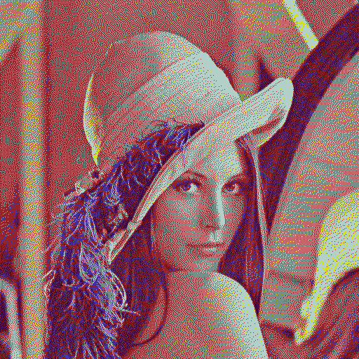

epd-dither
==========
This library implements a non-traditional method to dither images for display on 6-color e-paper displays such as the Spectra 6.
Where other libraries tend to use error-diffusion algorithms like Floyd-Steinberg and derivatives, this library treats the RGB colorspace like a 3 dimensional geometrical space, treats the Spectra 6 colors like an octahedron, and uses the barycentric coordinates as a way of describing how a color is best approximated on the display.

Floyd-Steinberg
---------------
The traditional Floyd-Steinberg error diffusion algorithm works by finding the closest color in the palette to each pixel, and shifting the difference (error) to the still-to-be-processed pixels to the right and down. e.g. If a pixel is purple, it would pick red now, and make the neighbouring pixels blue-er such that the next purple pixel would pick blue.

Although this gives reasonable results, there are downsides. One such downside is that with colors unable to be represented on the Spectra 6 display, it may bleed into other colors. e.g. for a plane of pure blue (which the Spectra 6 can't display), each pixel will be "rounded" to the gray-ish blue, and pixels to the right and down would be made more blue. However, since there is no color more blue, this ddifused error will never be compensated, until we run into a plane of other colors, which will be made blue-er until the accumulated rounding errors are compensated.

This library
------------
This library treats the RGB space as a 3D geometric space, and the Spectra 6 colors as an octahedron (e.g. two pyramids stacked). As an example visualize it as white on top, black on the bottom, and the corners of both pyramids would be red, yellow, green, blue. Each color inside that octahedron can be created using a mix of any of the vertices, e.g. gray can be made using 50% black 50% white, orange = 50% red 50% yellow, light orange =  40% red, 40% yellow, 20% white, etc.

The dithering works by first "decomposing" each pixel color into a mix of any of the Spectra 6 base colors, and then using noise to select one of those. In a mix of 70% black and 30% white, we'd end up choosing a black pixels 70% of the time and a white pixel 30% of the time.

Examples
--------
| Original | Dithered |
|----------|----------|
|  |  Dithered using this library with default settings and blue noise from HDR\_L\_0.png |
|  |  Dithered using epdoptimize. Note the algorithm changing the shape of the left eye. |

Note:
epdoptimize was used with the default parameters, but with the same color palette as in this library. The epdoptimize color palette can not be used with this library as it does not form a regular octahedron.
